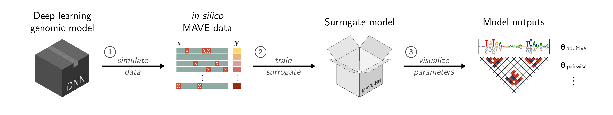

SQUID: interpreting sequence-based deep learning models for regulatory genomics
========================================================================
[](https://badge.fury.io/py/squid-nn)
[](https://pepy.tech/project/squid-nn)
[](https://squid-nn.readthedocs.io/en/latest/?badge=latest)
[](https://zenodo.org/doi/10.5281/zenodo.11060671)

<br/>


<br/>

**SQUID** (**S**urrogate **Qu**antitative **I**nterpretability for **D**eepnets) is a Python suite to interpret sequence-based deep learning models for regulatory genomics data with domain-specific surrogate models. For installation instructions, tutorials, and documentation, please refer to the SQUID website, https://squid-nn.readthedocs.io/. For an extended discussion of this approach and its applications, please refer to our paper:

* Seitz, E.E., McCandlish, D.M., Kinney, J.B., and Koo P.K. Interpreting *cis*-regulatory mechanisms from genomic deep neural networks using surrogate models.
<em>Nat Mach Intell</em> (2024). https://doi.org/10.1038/s42256-024-00851-5
---

## Installation:

With [Anaconda](https://docs.anaconda.com/free/anaconda/install/index.html) sourced, create a new environment via the command line:

```bash
conda create --name squid python==3.7.2
```

Next, activate this environment via `conda activate squid`, and install the following packages:

```bash
pip install squid-nn
pip install logomaker
pip install mavenn --upgrade
```

Finally, when you are done using the environment, always exit via `conda deactivate`.


### Notes

SQUID has been tested on Mac and Linux operating systems. Typical installation time on a normal computer is less than 5 minutes.

If you have any issues installing SQUID, please see:
- https://squid-nn.readthedocs.io/en/latest/installation.html
- https://github.com/evanseitz/squid-nn/issues

For issues installing MAVE-NN, please see:
- https://mavenn.readthedocs.io/en/latest/installation.html
- https://github.com/jbkinney/mavenn/issues

Older DNNs may require inference via Tensorflow 1.x or related packages not supported by MAVE-NN. Users will need to run SQUID piecewise within separate environments:
1. Tensorflow 1.x environment for generating *in silico* MAVE data
2. Tensorflow 2.x and Python>=3.72 environment for training MAVE-NN surrogate models

An example of this workflow using BPNet is provided in the `examples/` folder.


## Usage:
SQUID provides a simple interface that takes as input a sequence-based deep-learning model (e.g., a DNN), which is used as an oracle to generate an *in silico* MAVE dataset representing a localized region of sequence space. The MAVE dataset can then be fit using a domain-specific surrogate model, with the resulting parameters visualized to reveal the *cis*-regulatory mechanisms driving model performance.



### Examples

**Google Colab examples** for applying SQUID on previously-published deep learning models are available at the following links:

- [Additive (local) surrogate modeling with DeepSTARR](https://colab.research.google.com/drive/12HR8Vu_8ji3Ac1wli4wgqx1J0YB73JF_?usp=sharing)
- [Pairwise (local) surrogate modeling with ResidualBind-32](https://colab.research.google.com/drive/1eKC78YE2l49mQFOlnA9Xr1Y9IO121Va5?usp=sharing)
- [Variant effect (local) prediction with DeepSTARR–Kipoi](https://colab.research.google.com/drive/1wtpT1FF5nu1etTDOaV3A7ByXhuLqK071?usp=sharing)
- [Basic linear modeling using MAVE-NN, LIME and RidgeCV](https://colab.research.google.com/drive/1bcHSRxPy02pXHg9xZ1TjmjYro2ZZe25R?usp=sharing)


**Python script examples** are provided in the `examples/` folder for locally running SQUID and exporting outputs to file. Additional dependencies for these examples may be required and outlined at the top of each script. Examples include:
- [Variant effect (local) prediction with DeepSTARR–Kipoi](https://github.com/evanseitz/squid-nn/blob/master/examples/example_variant_effect.py)
- [Additive (global) surrogate modeling with BPNet–Kipoi](https://github.com/evanseitz/squid-nn/blob/master/examples/example_global_additive.py)
- [Pairwise (global) surrogate modeling with BPNet–Kipoi](https://github.com/evanseitz/squid-nn/blob/master/examples/example_global_pairwise.py)

As well, the [squid-manuscript](https://github.com/evanseitz/squid-manuscript) repository contains examples to reproduce results in the manuscript, including the application of SQUID on other DNNs such as ENFORMER

Expected run time for the "Variant effect (local) prediction with DeepSTARR–Kipoi" demo (above) is 4 minutes using Google Colab V100 GPU.


## Citation:
If this code is useful in your work, please cite our paper.

```bibtex
@article{seitz2023_squid,
	author = {Evan E Seitz and David M McCandlish and Justin B Kinney and Peter K Koo},
	title = {Interpreting cis-regulatory mechanisms from genomic deep neural networks using surrogate models},
	year = {2024},
	doi = {10.1038/s42256-024-00851-5},
	URL = {https://doi.org/10.1038/s42256-024-00851-5},
	journal = {Nature Machine Intelligence}
}
```

## License:
Copyright (C) 2022–2023 Evan Seitz, David McCandlish, Justin Kinney, Peter Koo

The software, code sample and their documentation made available on this website could include technical or other mistakes, inaccuracies or typographical errors. We may make changes to the software or documentation made available on its web site at any time without prior notice. We assume no responsibility for errors or omissions in the software or documentation available from its web site. For further details, please see the LICENSE file.
