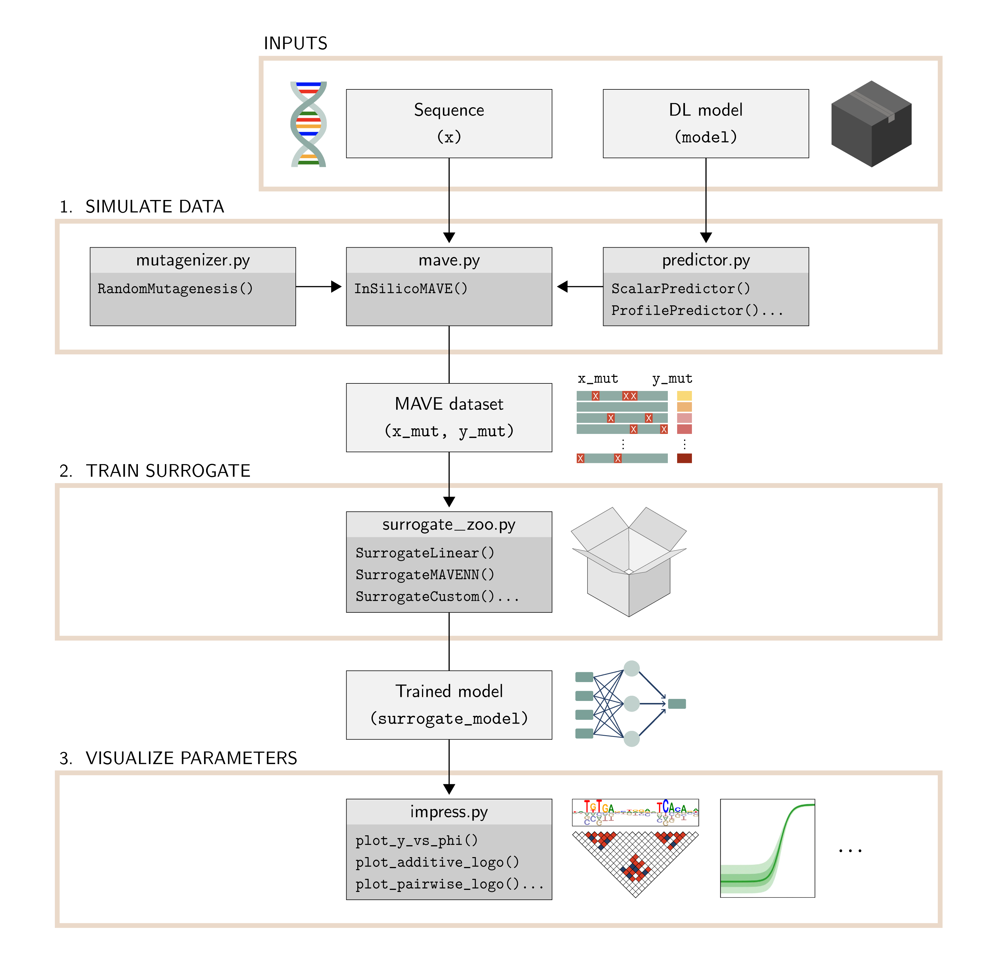

API Reference
=============

API Framework
-------------

A flowchart representing the SQUID code framework is provided below,
showing the flow of information between separate modules in the SQUID Python pipeline.

API Documentation
-----------------

This section contains auto-generated API reference documentation [#f1]_.

.. toctree::
   :titlesonly:

   
   
   {{ page.include_path }}
   
   

.. [#f1] Created with `sphinx-autoapi <https://github.com/readthedocs/sphinx-autoapi>`_

